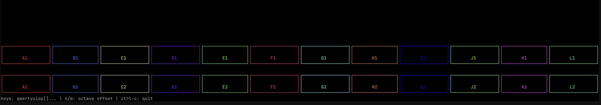
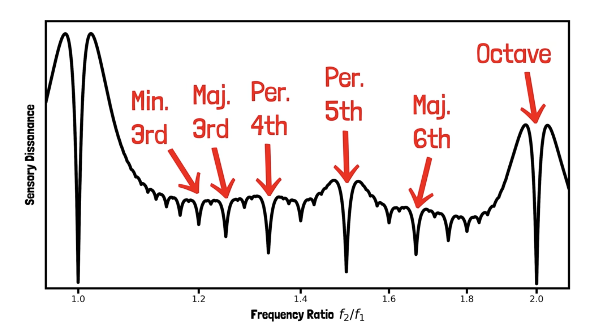
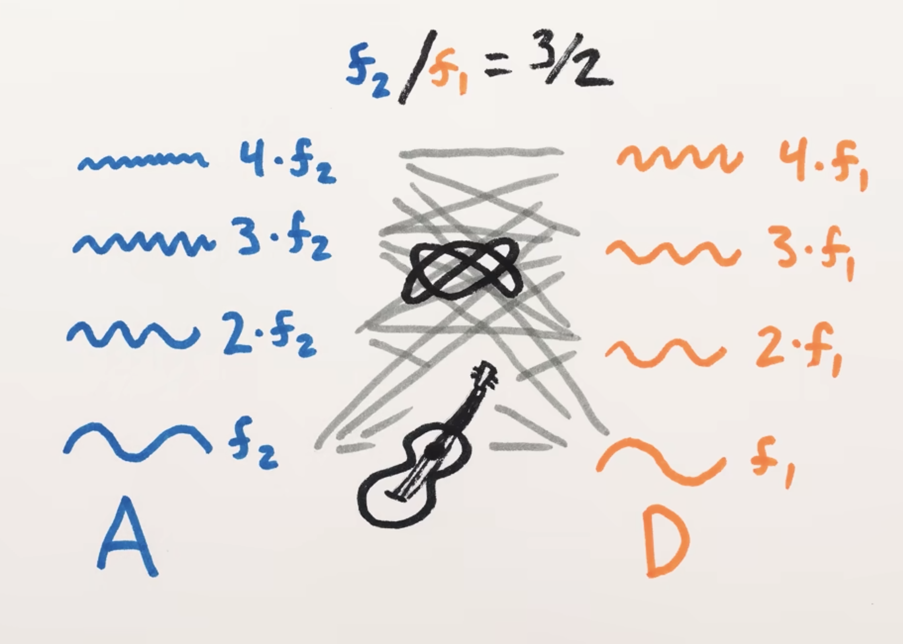
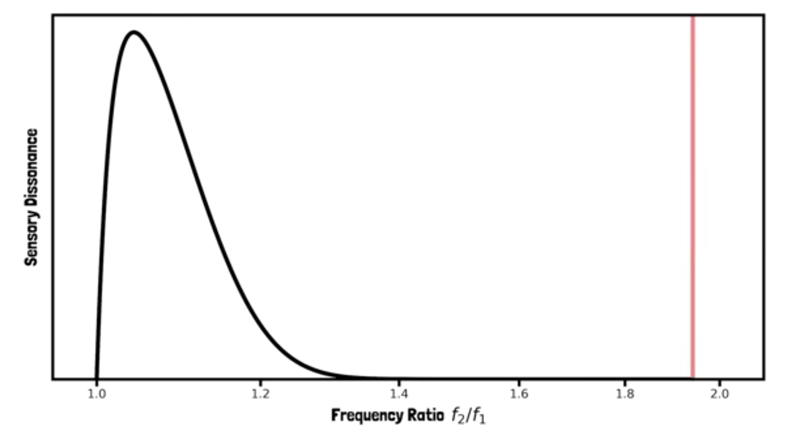

# 🍌 MuzMuzik

A playground for exploring music theory and digital sound synthesis from scratch.

## Requirements

**Terminal**: Kitty Keyboard Protocol compatible terminal only (macOS Terminal.app will NOT work).

Supported terminals: kitty, alacritty, ghostty, wezterm, foot, iterm2, rio

**OS**: Tested on macOS. Linux should work. Windows untested.

## Installation

**Option 1: Pre-built binaries (no Rust needed)**

Download from [releases](https://github.com/yourusername/muzmuzik/releases/latest):

- macOS (Apple Silicon): `muzmuzik-macos-aarch64`
- macOS (Intel): `muzmuzik-macos-x86_64`
- Linux: `muzmuzik-linux-x86_64`
- Windows: `muzmuzik-windows-x86_64.exe`

Make executable and run:
```bash
chmod +x muzmuzik-macos-aarch64
./muzmuzik-macos-aarch64 --keys "..."
```

**Option 2: Build from source**

```bash
cargo install --path .
# or
cargo build
cargo run
```

## Usage

**Important**: The default keyboard mapping is for my specific keyboard layout. You will almost certainly need to remap keys.

```bash
# Default (probably wrong for you)
music

# Custom mapping (24 unique ASCII characters)
music --keys "abcdefghijklmnopqrstuvwx"
```

**Controls:**
- Piano keys at bottom of screen — play notes
- `n` — Octave down
- `m` — Octave up
- `Ctrl+C` — Quit

## Keyboard Mapping

The `--keys` argument maps 24 keyboard keys to the note system across 2 octaves.

Default mapping (QWERTY):
```
qwertyuiop[]asdfghjkl{},
```

Provide exactly 24 unique ASCII characters:
```bash
music --keys "abcdefghijklmnopqrstuvwxyz"
```

Note pattern repeats across octaves, so index 0 and 12 both map to note A.

---

## Updating the Release

To build and upload new binaries for all platforms:

```bash
# Delete and recreate the tag locally
git tag -d latest
git push origin :refs/tags/latest

# Create and push new tag
git tag latest
git push origin latest
```

GitHub Actions will automatically build binaries for macOS (Intel + Apple Silicon), Linux, and Windows, and update the `latest` release.

## The Theory

Currently testing out a 12 equally tempered note system using letters A through L (A, B, C, D, E, F, G, H, I, J, K, L). Reference pitch: A1 = 130.815 Hz. Note that, my goal is really expand out of the 12-ET system. So the questions are, how can we build a notation such that it
- can be used for any music tradition/theory,
- is human readable,
- is machine encodable.


Color plays an important role here. Ideally, I would like to be able to look at a set of colors and understand the harmony. Then, I'd be able look at an entire song and understand whats hapenning where.

Imagine a color wheel. Currrently the colors constructed so that there is 210 degrees between each 12-ET consequetive note. One can set the base frequency to 0° and start learning the color combinations.


Though, I am not super convinced of this approach. I can see the idea of color coding working because i've already got used the major 3rd being green.



A problem is the fact that I've used the term "major 3rd". Most of are familiar with some dissonance chart like this:



This dissonance chart is actually produced by the overtones of an instrument. The dissonance of a "pure" sign wave with no overtones looks like this:





Watch the video [The Physics Of Dissonance](https://www.youtube.com/watch?v=tCsl6ZcY9ag) for a better understanding of dissonance.

So the issue is that, I can encode the relation between red and green as a major 3rd, but as you change instrument and its overtones, the harmony would change. So we loose the meaning of red and green. 

And in the digital world, we are not bounded by the overtones of natural instruments. As you can imagine, changing the overtones of an instrument creates a new dissonance chart and this new scales.

So, I am also thinking of the idea of mixing colors and being able to understand the dissonance. So, my instrument is playing red and green, but depending on the instrument, i color code the harmony/dissonance from white to black, where red-green-white would be harmonious major 3rd and red-green-dark gray would be like a bell for example.